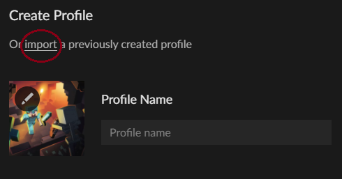
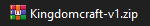
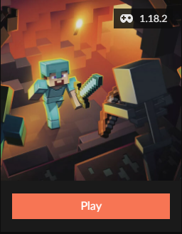

  <h3>Client-side modpack</h3>

  Requisitos para jugar

- 4 GB de RAM
- [Java 8](https://javadl.oracle.com/webapps/download/AutoDL?BundleId=245776_df5ad55fdd604472a86a45a217032c7d) **para los launcher no premium.**
- [Java 17](https://download.oracle.com/java/17/latest/jdk-17_windows-x64_bin.exe)

  <h2>Instrucciones para descargar e instalar el modpack<h3>
  

# MODPACK V1
- ## Usuarios Premium
  
  ### 1. Descargar CurseForge App
     
     [Download](https://download.curseforge.com/)
  
  ### 2. Descargar la [release correspondiente](https://github.com/Raykza/Kingdomcraft/releases/download/release/Kingdomcraft-v1.zip)
  
  ### 3. En la CurseForge App, seleccionar el juego y luego _Create Custom Profile_
     
     
  
  ### 4. Dentro del _custom profile_ dar a la opción para _importar_
     
     
  
  ### 5. Seleccionar el `.zip` de la release
     
     
  
  ### 6. Listo!
     
     

- ## Usuarios no Premium
  
  ### 1. Descargar y descomprimir la [release correspondiente.](https://github.com/Raykza/Kingdomcraft/releases/download/standalone/Kingdomcraft-v1-standalone.zip)
  
  ### 2. Instalar en `./minecraft` el cliente de [Forge (v40.0.18)](https://maven.minecraftforge.net/net/minecraftforge/forge/1.18.2-40.0.18/forge-1.18.2-40.0.18-installer.jar)
  
  ### 3. En la misma carpeta, sobreescribir su contenido con el del `.zip` de la release.
  
  ### 4. Listo!

# MODPACK V2
- ## Usuarios Premium
  
  ### 1. Descargar CurseForge App
     
     [Download](https://download.curseforge.com/)
  
  ### 2. Descargar la [release correspondiente](https://github.com/Raykza/Kingdomcraft/releases/download/release/Kingdomcraft-v1.zip)
  
  ### 3. En la CurseForge App, seleccionar el juego y luego _Create Custom Profile_
     
     
  
  ### 4. Dentro del _custom profile_ dar a la opción para _importar_
     
     
  
  ### 5. Seleccionar el `.zip` de la release
     
     
  
  ### 6. Listo!
     
     

- ## Usuarios no Premium
  
  ### 1. Descargar y descomprimir la [release correspondiente.](https://github.com/Raykza/Kingdomcraft/releases/download/standalone/Kingdomcraft-v1-standalone.zip)
  
  ### 2. Instalar en `./minecraft` el cliente de [Forge (v40.1.0)](https://maven.minecraftforge.net/net/minecraftforge/forge/1.18.2-40.1.0/forge-1.18.2-40.1.0-installer.jar)
  
  ### 3. En la misma carpeta, sobreescribir su contenido con el del `.zip` de la release.
  
  ### 4. Listo!
