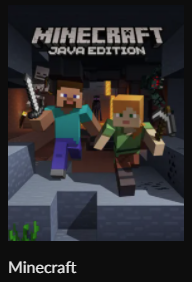
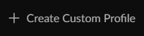

  <h1>Client-side modpack</h1>

  
  # Instrucciones para descargar el modpack
    
  ## Usuarios Premium
  
  ### 1.Descargar CurseForge App
  
   [Download](https://download.curseforge.com/)
  
  ### 2. Seleccionar juego
  
  
  
  ### 3. Seleccionar "Create Custom Profile" o "Crear perfil seleccionado" (para los hinchas de boca)
  
  
  
  ### 4. Selecionar la opcion de importar
  
  
  
  ### 5. Selecionar el archivo modpack
  
  
  
  ### 6. Ready to play
  
  
  - a
  - b
  - c
  - d
 
